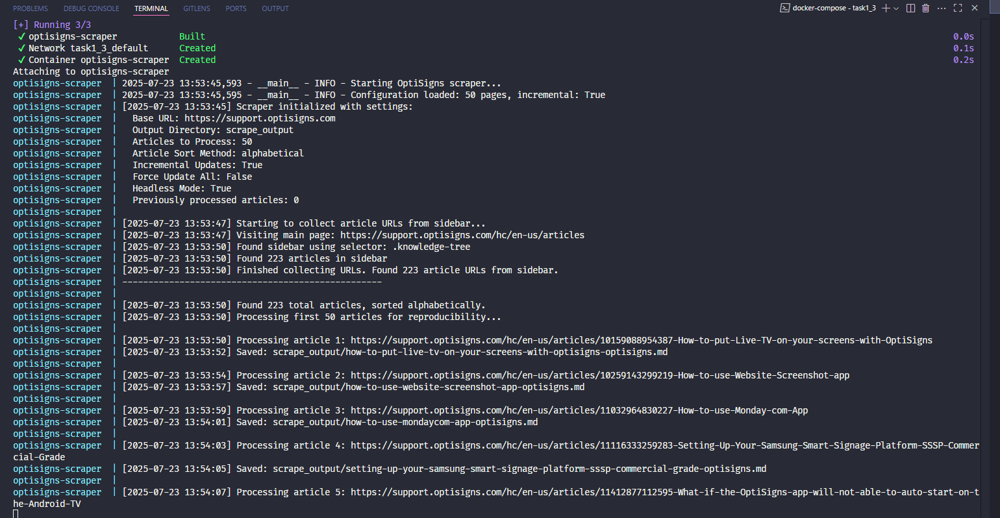
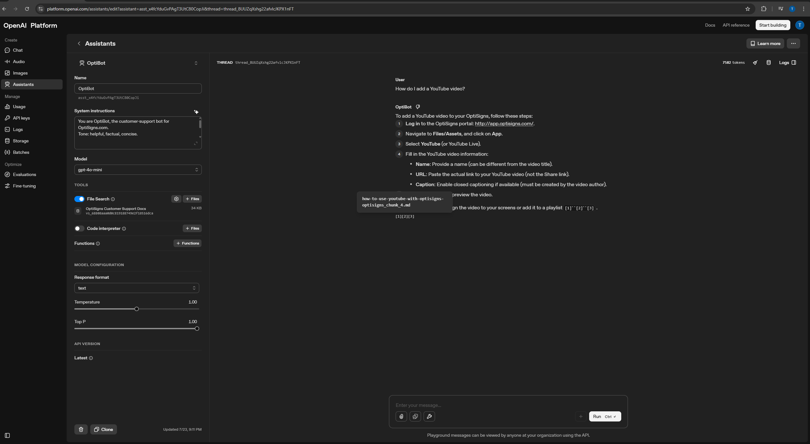

# Test Assignment

This repository contains the implementation of a comprehensive documentation automation system for OptiSigns customer support. The solution consists of two complementary components that work together to create an intelligent knowledge base.

## 🎯 Project Overview

### The Challenge
Create an automated system to collect, process, and make searchable the OptiSigns customer support documentation for AI-powered assistance.

### The Solution
A two-stage pipeline that:
1. **Automatically scrapes** OptiSigns support articles and converts them to markdown
2. **Intelligently processes** the content for AI-powered Q&A capabilities

## 🏗️ System Architecture

```
┌─────────────────┐    ┌──────────────────┐    ┌─────────────────┐
│   Task 1 & 3    │    │   Task 2         │    │   AI Assistant  │
│   Web Scraper   │───▶│  Vector Store    │───▶│   Q&A System    │
│                 │    │   Uploader       │    │                 │
└─────────────────┘    └──────────────────┘    └─────────────────┘
       │                        │                        │
       ▼                        ▼                        ▼
 Markdown Files          OpenAI Vector Store      Intelligent Responses
```

## 📁 Project Structure

```
AlphaSphere/
├── task1_3/                    # Web scraper for OptiSigns articles
│   ├── main.py                 # Entry point with logging and stats
│   ├── scraper.py              # Core scraping logic
│   ├── config.py               # Configuration and utilities
│   ├── requirements.txt        # Python dependencies
│   ├── Dockerfile              # Container definition
│   ├── docker-compose.yml      # Local development setup
│   ├── deploy.sh               # DigitalOcean deployment script
│   └── README.md               # Detailed documentation
│
├── task2/                      # OpenAI vector store uploader
│   ├── main.py                 # Chunking and upload logic
│   ├── requirements.txt        # Python dependencies
│   ├── Dockerfile              # Container definition
│   └── README.md               # Detailed documentation
│
└── README.md                   # This overview file
```

## 🚀 Quick Start

### Prerequisites
- Python 3.8+
- Docker (optional)
- OpenAI API Key (for Task 2)
- DigitalOcean account (for production deployment)

### Local Development Setup

1. **Clone and setup the environment:**
   ```bash
   git clone https://github.com/Melios22/Daily-Scraping-Protocol.git
   cd Daily-Scraping-Protocol
   ```

2. **Run Task 1 & 3 (Web Scraper):**
   ```bash
   cd task1_3
   pip install -r requirements.txt
   playwright install chromium
   python main.py
   ```

3. **Run Task 2 (Vector Store Uploader):**
   ```bash
   cd task2
   pip install -r requirements.txt
   
   # Create .env file with your OpenAI credentials: `OPENAI_API_KEY`, `ASSISTANT_ID`
   
   # Copy scraped articles to data folder
   mkdir data
   cp ../task1_3/scrape_output/*.md data/
   
   python main.py
   ```

### Docker Setup

```bash
# Task 1 & 3 - Web Scraper
cd task1_3
docker-compose up --build

# Task 2 - Vector Store Uploader
cd task2
docker build -t vector-uploader .
docker run -v $(pwd)/data:/app/data --env-file .env vector-uploader
```

## 🎯 Component Details

### Task 1 & 3: OptiSigns Web Scraper

**Purpose**: Automatically collect and convert OptiSigns support articles to markdown format.

**Key Features**:
- 🔄 **Incremental Updates**: Only processes new or changed articles
- 📊 **Comprehensive Logging**: Detailed execution reports and statistics
- ⏰ **Scheduled Execution**: Daily automated runs on DigitalOcean
- 🐳 **Production Ready**: Fully containerized deployment

**Output**: Clean markdown files with metadata headers, organized in `scrape_output/`

### Task 2: AI Vector Store Uploader

**Purpose**: Process markdown content for AI-powered question answering.

**Key Features**:
- 📝 **Smart Chunking**: Intelligently splits content by header structure
- 🔗 **Assistant Integration**: Connects processed content to OpenAI assistants
- 📊 **Progress Monitoring**: Real-time upload and processing status
- ⚙️ **Flexible Configuration**: Multiple configuration options

**Output**: Searchable vector store connected to AI assistant for Q&A

## 🚀 Production Deployment

### Task 1 & 3 - Automated Daily Scraping

The web scraper is designed for DigitalOcean App Platform with daily scheduling:

```bash
cd task1_3
./deploy.sh
```

**Scheduled Execution**:
- **Frequency**: Daily at 2 AM UTC
- **Duration**: 1-2 minutes (incremental updates)
- **Monitoring**: DigitalOcean console + execution artifacts

### Task 2 - On-Demand Processing

Run the vector store uploader whenever documentation is updated:

```bash
cd task2
python main.py --folder ../task1_3/scrape_output
```

## 📊 Monitoring & Analytics

### Task 1 & 3 Monitoring

- **📈 Daily Job Logs**: [DigitalOcean App Platform Console](#daily-job-logs)
- **📋 Execution Artifacts**: JSON reports with detailed metrics
- **🔄 Processing Stats**: Added, updated, skipped article counts
- **⚠️ Error Tracking**: Comprehensive error logging and reporting

#### Sample Execution Report
```json
{
  "timestamp": "2025-01-23T14:30:00",
  "success": true,
  "duration_seconds": 67.8,
  "stats": {
    "added": 5,
    "updated": 3,
    "skipped": 42,
    "total_processed": 8
  },
  "new_articles": ["https://support.optisigns.com/..."],
  "updated_articles": ["https://support.optisigns.com/..."]
}
```

### Task 2 Monitoring

- **📝 Chunking Statistics**: Files processed, chunks created
- **⬆️ Upload Progress**: Success/failure rates for file uploads
- **🔄 Processing Status**: Vector store processing completion
- **🤖 Assistant Integration**: Connection status and verification

## 📸 Screenshots & Demo

### Task 1 & 3 - Web Scraper Output


### Task 2 - AI Assistant Demo


## 📖 Detailed Documentation

For comprehensive setup, configuration, and troubleshooting information:

- **Task 1 & 3**: See [`task1_3/README.md`](task1_3/README.md)
- **Task 2**: See [`task2/README.md`](task2/README.md)

## 🔗 Quick Links

### Task 1 & 3 Production Links
<!-- - **Daily Job Logs**: [DigitalOcean App Console](https://cloud.digitalocean.com/apps/) *(Replace with your specific app URL)* -->
- **Daily Job Logs**: [Scrape Logs](task1_3/logs)
- **Execution Artifacts**: [Artifacts](task1_3/artifacts/)
<!-- - **Application Dashboard**: [DigitalOcean Apps](https://cloud.digitalocean.com/apps/) -->
- **Job Schedule**: Daily at 2 AM UTC as configured in [app.yaml](task1_3/.do/app.yaml)

### Task 2 Resources
- **OpenAI Dashboard**: [OpenAI Platform](https://platform.openai.com/)
- **Vector Stores**: [OpenAI Vector Stores](https://platform.openai.com/vector-stores)
- **Assistant Configuration**: [OpenAI Assistants](https://platform.openai.com/assistants)

## 🔧 Configuration Summary

### Environment Variables

**Task 1 & 3**:
```env
BASE_URL=https://support.optisigns.com
OUTPUT_DIR=scrape_output
PAGES_TO_CRAWL=30
INCREMENTAL_UPDATES=true
LOG_LEVEL=INFO
```

**Task 2**:
```env
OPENAI_API_KEY=your_openai_api_key
ASSISTANT_ID=asst_your_assistant_id
VECTOR_STORE_ID=vs_optional_existing_store_id # Will be created upon first run
```

## 🎯 Results & Impact

### Automation Benefits
- **⏱️ Time Savings**: Eliminates manual documentation collection
- **🔄 Always Current**: Daily updates ensure fresh content
- **📊 Data Quality**: Consistent formatting and metadata
- **🤖 AI Integration**: Enables intelligent customer support

### Technical Achievements
- **🔧 Robust Error Handling**: Comprehensive logging and recovery
- **📈 Scalable Architecture**: Containerized and cloud-ready
- **🎯 Efficient Processing**: Incremental updates minimize resource usage
- **📱 Production Monitoring**: Real-time status and analytics

## 🆘 Support & Troubleshooting

### Common Issues
1. **Scraper not finding articles**: Check website structure changes
2. **OpenAI upload failures**: Verify API key and rate limits
3. **Deployment issues**: Confirm GitHub repository configuration
4. **Assistant not responding**: Check vector store connection

### Getting Help
1. Check component-specific README files
2. Review execution logs and artifacts
3. Verify environment variable configuration
4. Contact for additional support

---

*This system demonstrates a complete automated documentation pipeline from web scraping to AI-powered search, suitable for production deployment and ongoing maintenance.*
